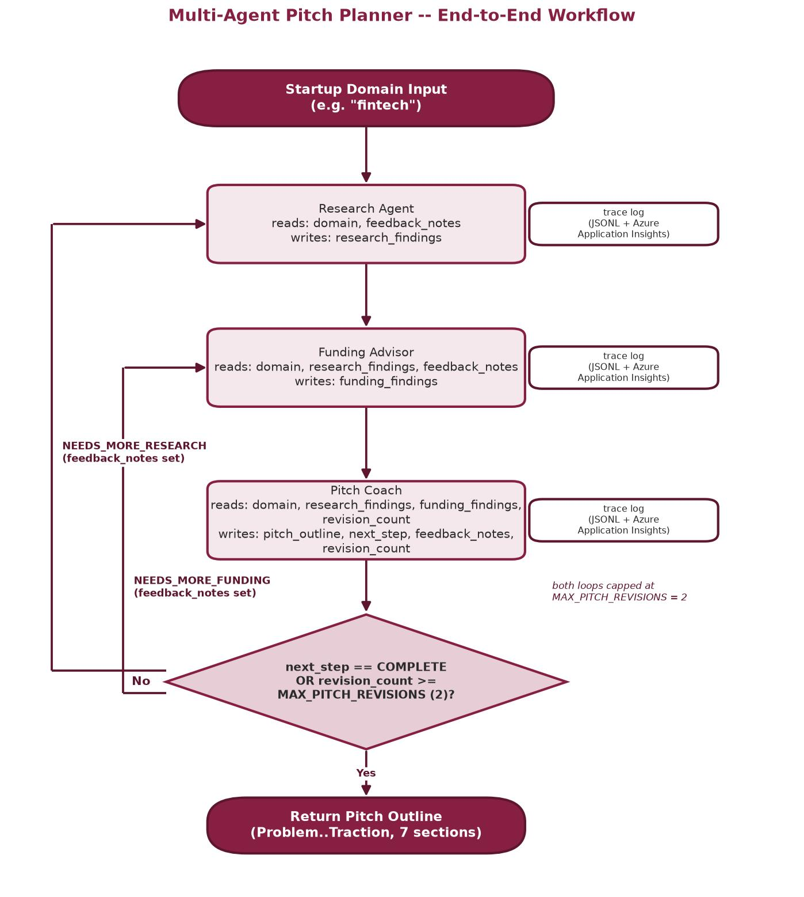
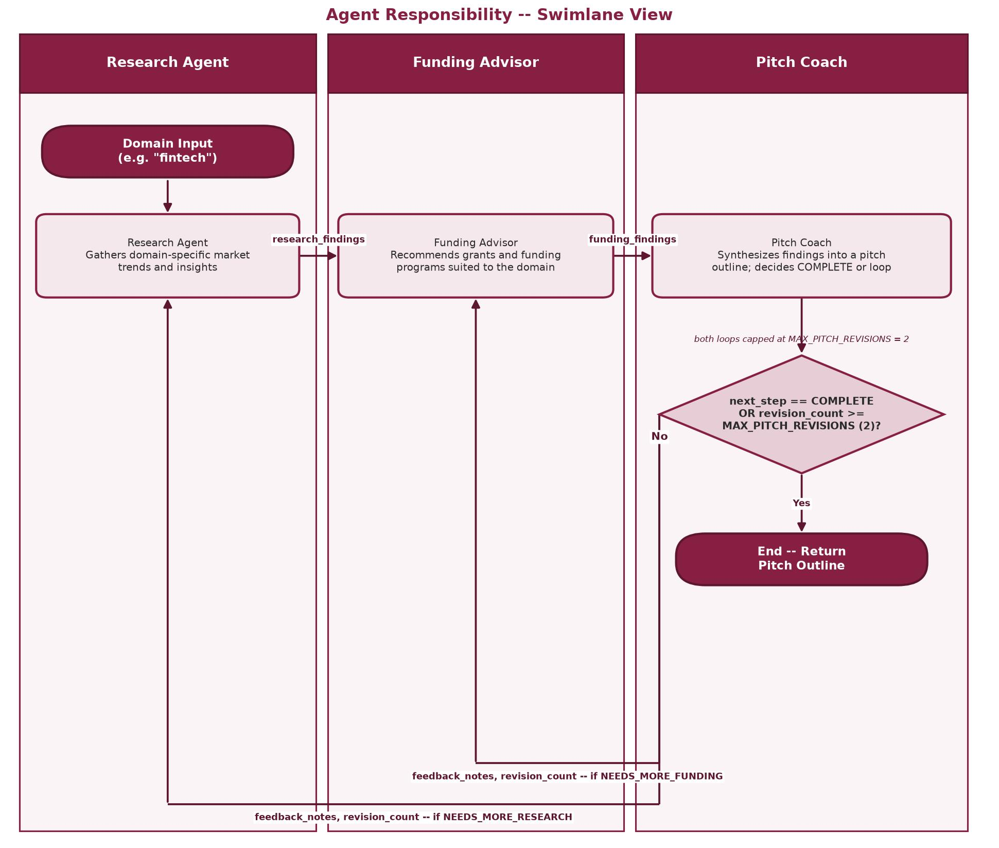

# **Multi-Agent Workflow Planner for a Startup Accelerator**

Course-end project, Module 10: VT_AGI Dev Tools & Product Readiness
(Virginia Tech | Microsoft | Simplilearn)

A startup domain (for example `fintech`) goes in; a founder-ready pitch deck outline comes out,
produced by three collaborating agents: a Research Agent, a Funding Advisor, and a Pitch Coach.

### [Reflection Document (PDF)](./assets/reflection.pdf)

The full project write-up -- architecture, design decisions, challenges and resolutions,
trade-offs, and a build walkthrough with screenshots -- lives in
[`assets/reflection.pdf`](./assets/reflection.pdf).

## Setup

```
python -m venv .venv
.venv\Scripts\activate
pip install -r requirements.txt
copy .env.example .env
```

Edit `.env` and set `OPENAI_API_KEY`. `AZURE_APPINSIGHTS_CONNECTION_STRING` is optional -- leave
it blank to run entirely on local logging (see Observability below).

## Running the demo

CLI:

```
python -m interface.cli --domain fintech
```

This prints the pitch deck outline and reports where the trace log was written
(`logs/run_<run_id>.jsonl`).

Notebook GUI (VS Code Jupyter extension): open `interface/notebook_gui.ipynb`, run all cells,
enter a domain in the text box, and click **Generate Pitch Outline**. Both interfaces call the
same `workflow.graph.run_workflow()` entry point -- no logic is duplicated between them.

## Running tests

```
pytest tests/
```

All agent, workflow, memory, and logging tests run against mocked OpenAI responses -- no API key
or network access is required to run the test suite.

# **System Architecture**

```
startup domain
      |
      v
+-----------------+     +--------------------+     +----------------+
| Research Agent  | --> | Funding Advisor    | --> | Pitch Coach    |
| (market trends)  |     | (grants/funding)    |     | (outline +     |
+-----------------+     +--------------------+     | route decision)|
        ^                        ^                  +--------+-------+
        |                        |                           |
        +---- feedback loop -----+---------------------------+
                (capped at 2 revisions)
```





- **Orchestration framework: LangGraph.** A `StateGraph` (`workflow/graph.py`) wires the three
  agents as nodes over a single shared, typed state object (`workflow/state.py`). LangGraph was
  chosen over CrewAI and AutoGen because:
  - **CrewAI** maps roles to Agents very naturally (arguably more literally than LangGraph), but
    its default sequential/hierarchical process has weaker native support for cyclic
    feedback -- looping the Pitch Coach's output back to an earlier agent is more of a bolt-on
    than a first-class feature.
  - **AutoGen** is built around open-ended multi-agent conversation (group chat), which is a
    weaker fit for this project's fixed, three-role pipeline with non-overlapping
    responsibilities.
  - **LangGraph's** explicit state graph gives native conditional/cyclic edges (the feedback
    loop is a first-class graph edge, not extra glue code) and an explicit, typed state object
    that is inspectable at every node transition -- which is exactly what the logging and
    reasoning-traceability requirement needs.
- **LLM backend:** OpenAI API (`langchain_openai.ChatOpenAI`, default model `gpt-4.1-mini`),
  configured once in `config.get_llm()` and reused by all three agents.
- **Vector memory:** a local Chroma collection (`memory/vector_store.py`), persisted under
  `data/chroma_store/`. Each agent's finding is stored keyed by domain and agent name, and
  retrieved as prior context on later runs (or later feedback-loop passes) for the same domain --
  so agents are not starting from nothing every time.
- **Observability:** every node transition is always logged locally as structured JSONL
  (`observability/trace_logger.py`, one line per transition in `logs/run_<run_id>.jsonl`). If
  `AZURE_APPINSIGHTS_CONNECTION_STRING` is set, the same transitions are also sent to Azure
  Application Insights as trace spans (`observability/azure_telemetry.py`); if it is not set, the
  code logs a single `[INFO] Azure telemetry not configured, using local logging only.` line and
  continues -- Azure is never required for the project to run.
- **Interfaces:** a CLI (`interface/cli.py`) and a Jupyter/ipywidgets notebook GUI
  (`interface/notebook_gui.ipynb`), both calling the same `workflow.graph.run_workflow()`
  function so there is exactly one implementation of the workflow logic.

# **Agent Roles and Responsibilities**

| Agent | Responsibility | Reads | Writes |
|---|---|---|---|
| **Research Agent** | Gathers domain-specific market trends and insights | `domain`, `feedback_notes` | `research_findings` |
| **Funding Advisor** | Recommends grants and funding programs suited to the domain | `domain`, `research_findings`, `feedback_notes` | `funding_findings` |
| **Pitch Coach** | Synthesizes research and funding findings into a pitch deck outline; decides whether the workflow ends or loops back for more detail | `domain`, `research_findings`, `funding_findings`, `revision_count` | `pitch_outline`, `next_step`, `feedback_notes`, `revision_count` |

Responsibilities are scoped so there is no overlap: only the Research Agent produces market
findings, only the Funding Advisor produces funding recommendations, and only the Pitch Coach
writes the final outline or decides on a feedback loop.

# **Coordination Flow and Feedback Loop**

1. The Research Agent runs first, producing market trends and insights for the given domain.
2. The Funding Advisor runs next, reading the Research Agent's findings and producing funding
   recommendations grounded in them.
3. The Pitch Coach synthesizes both into a pitch deck outline (Problem, Solution, Market,
   Business Model, Funding Ask, Team, Traction), then appends a verdict line to its own response:
   `COMPLETE`, `NEEDS_MORE_RESEARCH: <reason>`, or `NEEDS_MORE_FUNDING: <reason>`.
4. If the verdict is `COMPLETE` (or the revision cap has been reached), the workflow ends and
   returns the outline.
5. Otherwise, the workflow routes back to the Research Agent or Funding Advisor with
   `feedback_notes` set to the Pitch Coach's stated reason, and both agents re-run (research,
   then funding, then the Pitch Coach again) with that feedback in their prompt. This is capped
   at `config.MAX_PITCH_REVISIONS` (2) revisions so the loop always terminates.

Every one of these steps is written to the trace log (and to Azure Application Insights, if
configured) with the agent name, revision number, a summary of what it read, and what it wrote --
so the full reasoning path and every memory/context handoff between agents is reconstructable
after the fact.

# **Challenges and Trade-offs**

- **Feedback-loop termination.** A cyclic graph needs a guaranteed exit condition or it can loop
  indefinitely. `MAX_PITCH_REVISIONS` caps the loop at a small fixed number of passes regardless
  of what the model outputs, so termination does not depend on the model behaving well.
- **Routing signal reliability.** The Pitch Coach's routing decision is parsed from a single
  verdict line the model is asked to append, rather than a second structured-output call. This
  keeps the design simple (one call per agent, per the project's "simple and boring over clever"
  standard) at the cost of being slightly less robust than a dedicated structured-output schema;
  if the model omits the verdict line, the code defaults to ending the workflow rather than
  looping or erroring.
- **Feedback loop re-runs both upstream agents.** Routing back to the Research Agent re-runs the
  Funding Advisor as well (since the graph's fixed edges always flow research -> funding ->
  pitch coach), even if only the research findings needed revision. This was a deliberate choice
  to keep the graph simple (one conditional edge, not one per source/target agent pair) at the
  cost of an extra Funding Advisor call on a research-only revision.
- **Azure observability is optional by design.** Because it was not certain at build time whether
  an Azure subscription would be available, Application Insights integration had to degrade
  gracefully rather than being load-bearing -- local JSONL logging is the actual source of truth
  the project depends on; Azure is additive.
- **Chroma's default embedding model.** The first call to the vector store may need network
  access to download Chroma's default local embedding model; it is cached afterward. No API key
  or paid service is required for this.
